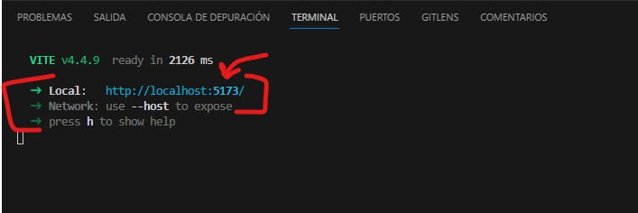

# ViveroWebPage
Pagina web para el servicio comunitario Intervenciones Urbanas de la Universidad Simón Bolívar.

## Requisitos para ejecutar en Windows o Linux
**-** Sistema operativo Windows x64 o alguna distribución de Linux.

**-** Tener instalado Visual Studio Code (https://code.visualstudio.com/download)

**-** Tener instalado Git (https://git-scm.com/downloads)

**-** Tener instalado NodeJS (https://kinsta.com/es/blog/como-instalar-node-js/)

## Clonación del Repositorio en Windows

**1.** Crear una carpeta en Documentos con el nombre que usted quiera.

**2.** Dentro de la carpeta abrir la terminal con click derecho, le saldrá la opción *```Abrir en Terminal```*

**3.** Escribir:

```
git clone https://github.com/usbserviciocomunitario/ViveroWebPage.git
```
   
Y luego dar enter. Debe esperar hasta que termine la clonación del repositorio.
   
**4.** Luego, abrir la carpeta ViveroWebPage que se encuentra en la carpeta que creó anteriormente.

**5.** Dentro de ViveroWebPage dar click derecho y seleccionar *```Abrir con Code```*, se le abrirá Visual Studio Code con las carpetas del backend y frontend.

**6.** Dentro de Visual Studio abrir su terminal con *```ctrl+j```*

## Ejecución en Windows

   ### Para el frontend:

**-** Escribir en la terminal “cd frontend” y dar enter.

**-** Escribir en la terminal ```npm install``` y dar enter. Debe esperar que se instalen todas las dependencias.

**-** Luego, debe instalar la librería scss con el comando: ```npm install -D sass```

**-** Finalmente, para ejecutar el frontend de la aplicación debe correr el comando: ```npm run dev```

**-** Seguido de esto, podrá observar un link al cual podrá dirigirse haciendo *```ctrl+click```* sobre el mismo.




  ### Para el backend:

**-** Abrir una nueva terminal con *```ctrl+shift+5```*. Esto dividirá la terminal en dos.

**-** En esta nueva terminal escribir ```cd backend``` y dar enter.

**-** Escribir en la terminal ```npm install``` y dar enter. Debe esperar que se instalen todas las dependencias.
